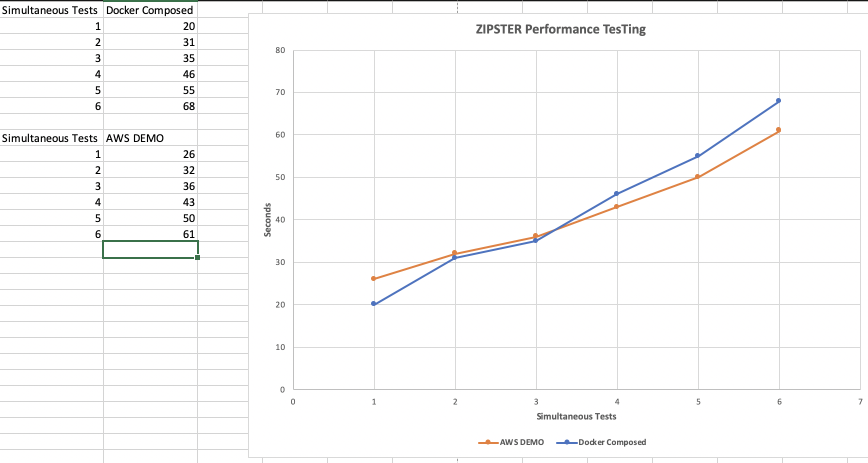
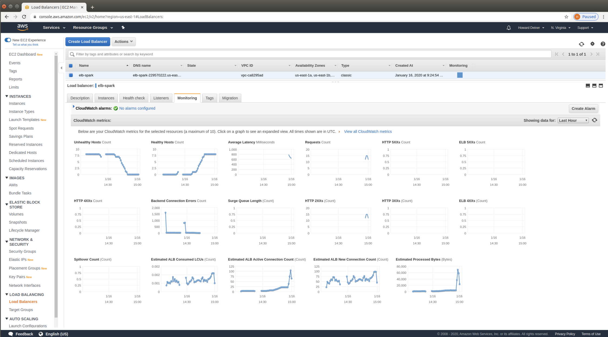

### How to create and test a modern REST API in a server farm environment.

##### Concept
Let's say we want to design a REST API that can take a zipcode and a radius and return all the zipcodes within a certain number of miles to the given center of that zipcode.

Architecturally, we will use the following framworks and tools:

- Docker containers.  Lots of them.
- Java (for our code)
- Spark (for running a small REST server)
- MySQL (for persistence of a zipcode database)
- FlyWay (to version control the database)
- Wiremock (for designing and validating the API's contract)
- Cucumber for Java (to run our integration tests in)
    - locally in Docker containers (WireMock, Spark, MySQL).  Zipster server running on desktop.  Test code running on desktop.
    - locally in Docker containers (WireMock, Space, MySQL, Zipster)  Test code running on desktop.
    - in AWS cloud (using Terraform), including 8 EC2 Zipster instances and an Elastic Load Balancer in front of them
- Vault will also be a vital component of this project.  We will use it for holding together environments, the endpoints in those environments,and the secrets needed for those environments.

Here's a sample of what zipster does:

---
##### Explanation of the scripts to run.  
A play in 4 acts.  The scripts are broken down into fairly small chunks so you can execute the script and look carefully at the results, such as what the AWS console looks like, what the Vault server shows, the test results, etc.  This project is designed to learn from, not be a production solution.

###### We first have part_1_create images.  

Our job here is to create images ready to go for both our code and our database backend.

- step_1_dockerize_zipster_mysql starts up a MySQL container, and uses FlyWay to load the test data into the database.  The files that the database uses are serialed into a tarball that will be used later, when we start up database containers.
- step_2_dockerize_zipster_spark builds a fresh jar with all dependencies baked in, and starts up a Spark container with everytthing ready to go.  
- step_3_push_images does just that.  The newly baked container are pushed up to DockerHub.

##### So, what can we do with these images?  part_2_test_in_docker_composed_environment begins the journey.
How about we start with a test that runs all the necessary containers for integration testing right on our desktop?

- step_1_start_docker-compose_vault-mysql-wiremock-zipster_environment bring up docker composed containers.  Ready the Vault injection point at /tmp/config/zipster.  We will hold 3 files there: an environment, vault_addr, and vault_token.
- step_2_setup_vault_in_vault-mysql-wiremock-zipster_environment sets up Vault.  This means unsealing Vault, and saving the initial root token.  It also means seting up a key/value version 2 store for UUIDS and ENVIRONMENTS.  Each container will be assigned a UUID, and ENVIRONMENTS will contain unique values (in this projects, values such as DOCKER_COMPOSED and AWS_DEMO are used).  Furthermore, a taxonomy is established to store secrets, such as the following.

- step_3_ready_vault_in_vault-mysql-wiremock-zipster_environment contacts the Vault server and places key/value pairs in Vault that allow the connections to occur.  It also injects values into /tmp/config/zipster so the test client can find the zipster server.
- step_4_verify_in_vault-mysql-wiremock-zipster_environment runs the tests from maven against both the WireMock and Zipster servers.
- step_5_performance_timing_in_vault-mysql-wiremock-zipster_environment runs tests for 1, 2, 3, 4, 5, and 6 simulatenous executations against Zipster to get metrics as to how efficiently we get service in tests per second.
- step_6_destroy_docker-compose_vault-mysql-wiremock-zipster_environment does exactly what it says.  It uses docker-compose to bring down the environment and cleans up.

##### part_3_test_in_desktop_environment mixes it up a little.
Now, let's try running the Zipster server on the desktop, the maven test code on the desktop, and everything else in Docker running on our machine?

- step_1_start_docker-compose_vault-mysql-wiremock_environment bring up docker composed containers.  Ready the Vault injection point at /tmp/config/zipster.  We will hold 3 files there: an environment, vault_addr, and vault_token.
- step_2_setup_vault_in_vault-mysql-wiremock_environment sets up Vault.  This means unsealing Vault, and saving the initial root token.  It also means seting up a key/value version 2 store for UUIDS and ENVIRONMENTS.  Each container will be assigned a UUID, and ENVIRONMENTS will contain unique values (in this projects, values such as DOCKER_COMPOSED and AWS_DEMO are used).  The taxonomy established here is similar to the DOCKER_COMPOSED environment, except this one is called DESKTOP.
- step_3_ready_vault_in_vault-mysql-wiremock_environment contacts the Vault server and places key/value pairs in Vault that allow the connections to occur.  It also injects values into /tmp/config/zipster so the test client can find the zipster server.
- step_4_verify_in_vault-mysql-wiremock_environment runs the tests from maven against both the WireMock and Zipster servers.  Except, in this part, we run the zipster server in the background directly on the desktop, then run the tests, then kill the server we started.
- step_5_destroy_docker-compose_vault-mysql-wiremock_environment does exactly what it says.  It uses docker-compose to bring down the environment and cleans up.

##### part_4_test_in_aws_environment goes nuts and uses the cloud to do our bidding.
Here, instead of using docker-compose to orchestrate local containers, we will use terraform to orchestrate AWS resources to do everything remotely.

- step_1_terraform_aws_environment does just that. Terraform output for the EC2 instances are saved locally for contact with the machines later in the process.  Here's what the AWS console looks like when the terraform script completes:

- step_2_provision_vault_in_aws does it's dirty work by sending up vault initialization scripts using bolt that establish a Docker environment on the instance, starting up a Vault container, waiting for it to start, and then parsing out the initial root token.
- step_3_provision_wiremock_in_aws does it's dirty work by sending up wiremock initialization scripts using bolt (along with the WireMock faking files) that establish a Docker environment on the instance, starting up a WireMock container, and waiting for it to start.
- step_4_provision_mysql_in_aws does its work by sending up MySQL initialization scripts using bolt that establishes a Docker environment on the instance, starting up a MySQL container, and waiting for it to start.  The data that the database uses is uploaded, untarred, and mounted for the database to use.
- step_5_provision_zipster-spark_in_aws goes about its task by sending up an initialization script using bolt that establishes a Docker environment on the instance, starting up the zipster-spark container from DockerHub, and waiting for it to start.  Right now, it also copies the injected environment, vault_addr, and vault_token into the container from the instance, even though it is volume mapped into the container.  This should be fixable by working with the Dockerfile for the image.
- step_6_provision_and_run_testrunner_in_aws works by uploading the environment injection information to the testrunner instance (environment, vault_addr, and vault_token) so that the test client can ask Vault for information to talk to Zipster.  It then uploads a provisioning script to the instance which establishes an environment for testing (Java, Maven, and the code that drives the tests through Maven).  Finally, it executes the tests, which exercice everything that we setup.  It also executes the performance tests for 1, 2, 3, 4, 5, and 6 simulatenous executations against Zipster to get metrics as to how efficiently we get service in tests per second.
- step_7_teardown_aws_environment is quite simple.  It runs terraform to destroy the environments that we so carefuly crafted, which proves that it's much easier to destroy than create.  But we can simply the scripts again, and we will get reproducable results each and every time.

---

##### What have we demonstrated?

- There is value in always deploying our applications the same way.  I choose Docker containers, because I can quickly deploy to my desktop in a docker-composed environment in a very similar way to terraforming an orchestrated set of AWS EC2 containers.
- Difficult endpoint and secrets management can become a thing of the past with automated and perhaps a centralized Vault.
- Scaling Docker Container based AWS deployments can scale efficiently.

- From the standpoint of the AWS Elastic Load Balancing monitor, here's a sample taken right after the tests were run on the testrunner against the load balnced zipster REST API.

